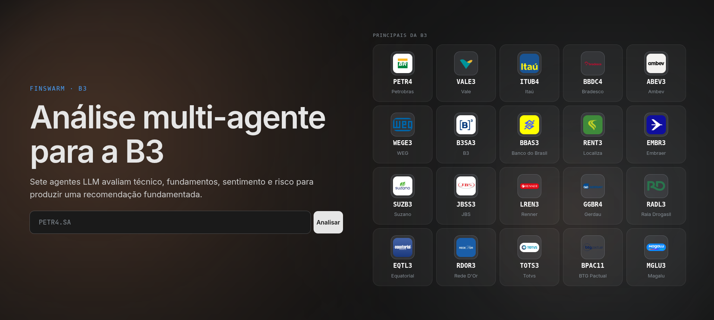
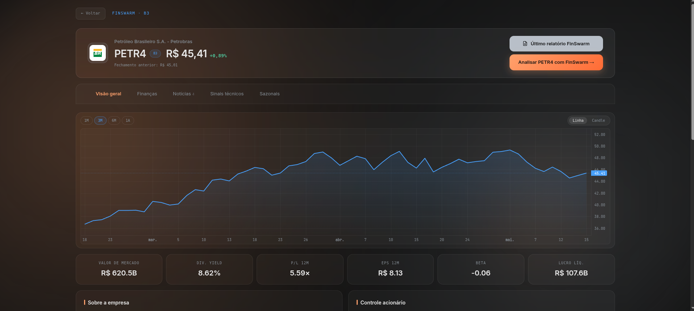
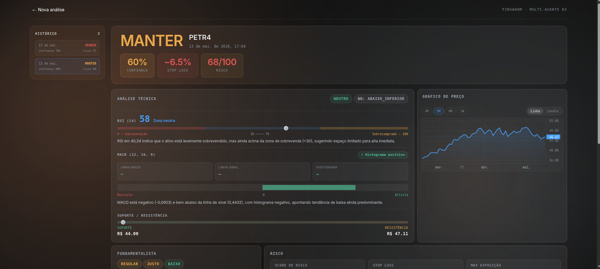

<div align="center">



<br/>
<br/>

# FinSwarm

**Análise multi-agente para ações da B3**

Sete agentes LLM especializados avaliam técnico, fundamentos, sentimento e risco em paralelo para produzir uma recomendação fundamentada — COMPRAR, MANTER ou VENDER.

<br/>


</div>

---

## O que é

FinSwarm orquestra sete agentes LLM em paralelo, cada um especializado em uma dimensão da análise de ações brasileiras. Os resultados são sintetizados em tempo real e exibidos em um painel interativo com gráficos de preço, indicadores técnicos, dados fundamentalistas e histórico de análises.

---

## Screenshots

<table>
<tr>
<td width="50%">

**Página de ação — Visão geral**



Cotação ao vivo, gráfico interativo (linha ou candle), KPIs fundamentalistas e cinco abas: Visão geral, Finanças, Notícias, Sinais técnicos e Sazonais.

</td>
<td width="50%">

**Relatório de análise completo**



Recomendação, confiança, stop-loss e risk score exibidos assim que o último agente termina. Cada agente tem seu próprio card com saída detalhada.

</td>
</tr>
</table>

---

## Arquitetura

```
┌─────────────────────────────────────────────────────────────┐
│                        Orquestrador                         │
│                    (asyncio + FastAPI WS)                   │
└──────┬──────┬──────┬──────┬──────┬──────┬──────────────────┘
       │      │      │      │      │      │
   Técnico Funda- Senti- Risco Sazo- Deba-  Síntese
           mental mento        nais  tedor
       │      │      │      │      │      │       │
       └──────┴──────┴──────┴──────┴──────┴───────┘
                          │
                   AnalysisResult
              (COMPRAR / MANTER / VENDER)
```

| Agente | Responsabilidade |
|---|---|
| **Técnico** | RSI, MACD, médias móveis, suporte/resistência |
| **Fundamental** | P/L, EV/EBITDA, ROE, margem, dívida |
| **Sentimento** | Notícias recentes via GNews, polaridade |
| **Risco** | Volatilidade, beta, drawdown máximo |
| **Sazonais** | Padrões históricos por mês (5 anos) |
| **Debatedor** | Questiona e desafia os outros agentes |
| **Síntese** | Consolida tudo e emite a recomendação final |

Cada agente roda em paralelo via `asyncio`. O frontend acompanha o progresso em tempo real via WebSocket e cai back para REST quando a análise já está no banco.

---

## Stack

**Backend**
- **Python 3.12** + **FastAPI** — API REST + WebSocket
- **yfinance** — cotações, OHLCV, dados fundamentalistas
- **fundamentus** — métricas adicionais de empresas BR
- **GNews** — busca de notícias recentes
- **aiosqlite** — persistência de análises e cache de dados
- **OpenRouter** — roteamento multi-modelo (GPT, GLM, Nemotron)
- **Poetry** — gerenciamento de dependências

**Frontend**
- **React 18** + **TypeScript 5** + **Vite 5**
- **Tailwind CSS v4** com design system Solar Flare (`#ffa16c` / `#479ffa`)
- **lightweight-charts** — gráficos de preço TradingView-style
- **lucide-react** — ícones
- **Vitest** + **React Testing Library** — 54 testes

---

## Como rodar

Você vai precisar de dois terminais.

### Pré-requisitos

```bash
# Python (backend)
pip install poetry
poetry install

# Node (frontend)
cd web && npm install
```

Crie um `.env` na raiz com sua chave do OpenRouter:

```env
OPENROUTER_API_KEY=sk-or-...
```

### Terminal 1 — Backend

```bash
poetry run uvicorn src.api:app --port 8000 --ws wsproto
```

> **`--ws wsproto` é obrigatório.** Sem essa flag o Chrome rejeita o handshake WebSocket com 400 Bad Request.

### Terminal 2 — Frontend

```bash
cd web && npm run dev
```

Acesse em **http://localhost:5173**. O Vite faz proxy automático de todas as chamadas de API para o backend.

---

## Estrutura do projeto

```
finswarm/
├── src/                        # Backend Python
│   ├── api.py                  # FastAPI — endpoints REST + WebSocket
│   ├── orchestrator.py         # Orquestração asyncio dos 7 agentes
│   ├── models.py               # Tipos compartilhados (Pydantic)
│   ├── db.py                   # Persistência SQLite via aiosqlite
│   ├── agents/                 # Os 7 agentes LLM
│   ├── data/                   # Adapters: yfinance, fundamentus, GNews
│   └── llm/                    # Client OpenRouter + roteamento por agente
├── web/                        # Frontend React
│   └── src/
│       ├── pages/              # Home, StockDetail, Analysis
│       ├── components/         # AgentBento, PriceChart, TabBar, ...
│       └── lib/                # Hooks, tipos, API client
├── tests/                      # Testes do backend (68 unitários + integração)
├── docs/
│   ├── STATUS.md               # Estado atual do projeto
│   ├── design/style.md         # Design system v2 (Solar Flare palette)
│   ├── dev/run.md              # Instruções de execução detalhadas
│   ├── screenshots/            # Imagens da interface
│   └── superpowers/            # Specs e planos de implementação
├── pyproject.toml
└── poetry.lock
```

---

## Modelos LLM

O roteamento é configurado em `src/llm/routing.py`:

| Rota | Modelo primário | Fallback |
|---|---|---|
| `default` | `openai/gpt-oss-120b:free` | `z-ai/glm-4.5-air:free` |
| `sentiment` | `z-ai/glm-4.5-air:free` | `openai/gpt-oss-120b:free` |
| `synthesis` | `nvidia/nemotron-3-super-120b-a12b:free` | `openai/gpt-oss-120b:free` |

Os modelos `:free` do OpenRouter têm limite de taxa. Se uma análise travar, verifique a disponibilidade dos modelos antes de declarar bug — eles mudam de estabilidade com frequência.

---

<div align="center">

Feito com asyncio, sete agentes e muita paciência com o yfinance.

</div>
